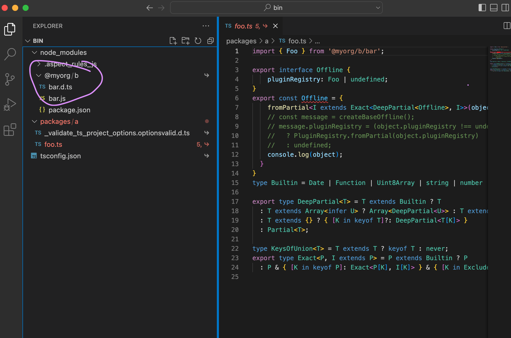
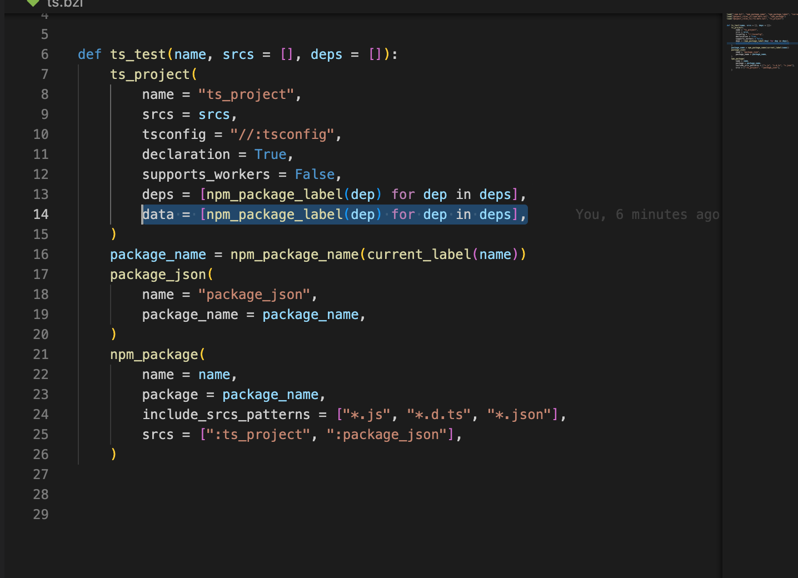

Transitive dependency are not linked underneath `node_modules`
===============

A demo of the bug that causes portability issues in `rules_js`:

Just run:
```
bazel run //:foo --sandbox_debug
```

And it will produce the following error:

```
error TS2742: The inferred type of 'Offline' cannot be named without a reference to '.aspect_rules_js/@myorg+c@0.0.0/node_modules/@myorg/c/qux'. This is likely not portable. A type annotation is necessary.
```

The reasons seems to be there is no linkage underneath `node_modules`(The screenshot is of the bin folder in sandbox):



And when you remove `data` attribute in `ts.bzl` the error dissapears:


